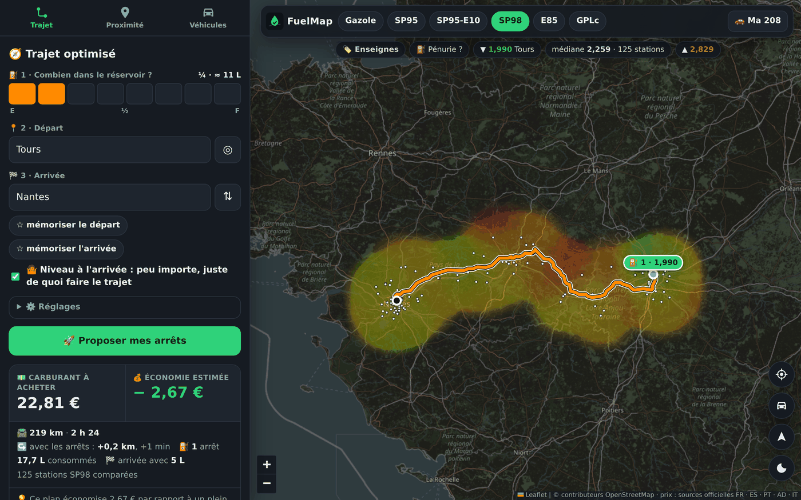
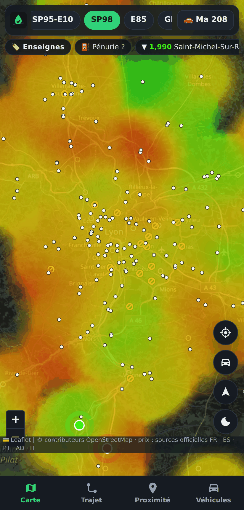
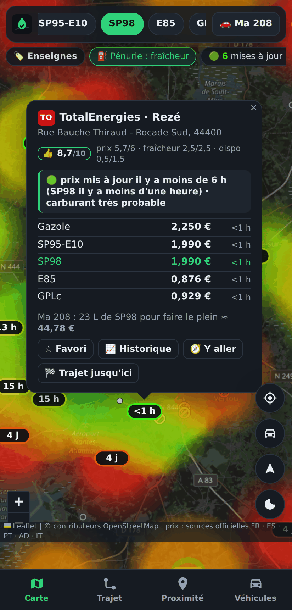
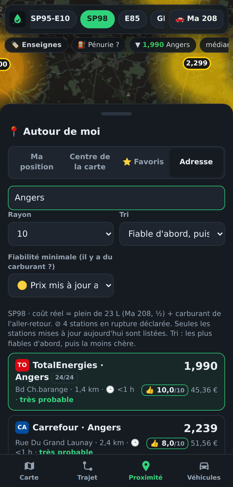
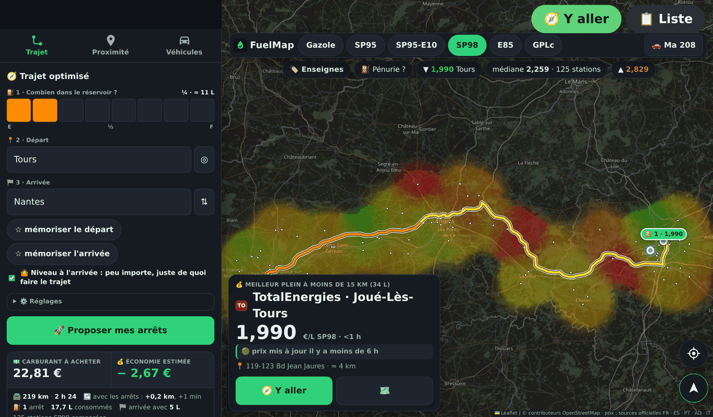

# FuelTrajetMap

Carte des prix des carburants + **optimiseur de pleins sur trajet**, selon ton véhicule.
Appli web installable (Android, iOS, PC), **sans backend** : une page statique qui interroge directement les
données officielles. Successeur de FuelMap85 (Expo + FastAPI).

Inspiré par [plein-moins-cher.fr](https://plein-moins-cher.fr/) et son appli Fillgo, avec ce qui leur manquait :
un profil véhicule, et un calcul des arrêts sur un trajet qui optimise vraiment le budget (où s'arrêter *et* combien
de litres mettre). Site en ligne : https://soaresden.github.io/FuelTrajetMap/

  

  
  
  
  

Trajet optimisé · heatmap et ruptures · mode pénurie et indice de confiance · Proximité « fiable puis pas cher » · écran voiture (Android Auto)

## Pourquoi c'est rapide

- Toute la France (~9 800 stations, ~950 Ko compressés) est chargée **une fois**, gardée en cache (IndexedDB) et
  réaffichée instantanément au lancement suivant ; actualisation en arrière-plan au-delà de 10 min.
- Une seule couche `<canvas>` maison (heatmap de prix + points + pastilles) : ~20 ms pour redessiner la France entière
  sur mobile. Aucun marqueur DOM, aucun aller-retour serveur quand on bouge la carte.
- Aucun serveur à maintenir ni à payer : les données viennent des sources officielles et de GitHub Pages.

## Fonctionnement

1. **Premier lancement** : saisie obligatoire d'un véhicule (carburant, contenance, consommation). Pas de carte sans véhicule.
2. **Carte** : heatmap des prix du carburant choisi (vert fluo = pas cher, rouge = cher, échelle recalculée sur la zone
   visible), station la moins chère / la plus chère en marqueurs pulsants, prix lisibles en zoomant.
3. **Trajet** : niveau actuel (jauge en huitièmes) → départ → arrivée → *Proposer mes arrêts*. Le résultat est une
   **proposition modifiable** : pour chaque arrêt, « Changer » liste les autres stations possibles avec l'écart de coût
   total, « Retirer » le supprime, et toucher une station sur la carte permet de s'y arrêter. Le trajet réel (via les
   arrêts) est recalculé et coloré selon le niveau du réservoir ; le trajet d'origine reste en pointillé en fond.
4. **Proximité** : classement par *coût réel du plein* (prix × litres + carburant de l'aller-retour), ou « fiable
   d'abord » ; origine GPS, centre de la carte, favoris ou n'importe quelle adresse.
5. **Pénurie** : ruptures déclarées barrées ⊘, indice de confiance « il y a du carburant ? », mode carte par fraîcheur.

### L'optimiseur (`js/optimizer.js`)

Programmation dynamique exacte du « gas station problem » : à chaque arrêt, soit on prend juste de quoi atteindre
l'arrêt suivant s'il est moins cher (appoint), soit on fait le plein s'il est plus cher. Pris en compte : détour de
chaque station, réserve de sécurité jamais entamée, niveau voulu à l'arrivée, « prix » d'un arrêt (pour éviter les
micro-arrêts). Vérifié contre une recherche exhaustive sur 4 000 cas aléatoires : `node tests/optimizer.test.js`.

Limites connues : le détour est estimé (distance à la route × 1,35 + 1 km hors autoroute) puis recalculé en vrai
pour les arrêts retenus ; le sens de circulation des aires d'autoroute n'est pas connu des données.

## Pays couverts

| Pays | Source | Dans le navigateur |
|---|---|---|
| France | prix-carburants.gouv.fr (data.economie.gouv.fr) | direct, sinon `data/fr.json` (secours) |
| Espagne | Ministerio para la Transición Ecológica | `data/es.json`, sinon direct (12 Mo) |
| Portugal | DGEG — *usage non commercial uniquement* | `data/pt.json`, sinon direct |
| Andorre | Govern d'Andorra (ArcGIS public) | `data/ad.json`, sinon direct |
| Italie | MIMIT, licence IODL 2.0 | **uniquement** `data/it.json` (la source n'autorise pas les navigateurs) |
| Belgique, Suisse, Luxembourg | aucune donnée ouverte par station (seulement des prix maximums nationaux en BE/LU) | — |
| Allemagne | Tankerkönig : clé API personnelle, non publiable dans une appli statique | — |

Les pays voisins ne sont chargés que si la carte (zoom ≥ 7) ou un trajet les touche. `data/*.json` est régénéré par
`node tools/build-data.mjs` — la GitHub Action fournie le fait toutes les 3 h.
À l'étranger, une voiture SP95-E10 se voit proposer le SP95 (E5), compatible.

## Enseignes, historique, carburants compatibles

- **Enseignes** : absentes des données de l'État. `tools/build-data.mjs brands` les récupère dans OpenStreetMap (ODbL), où
  presque toutes les stations portent l'identifiant officiel (`ref:FR:prix-carburants`) : ~99 % de correspondance.
  Filtre « 🏷️ Enseignes » sur la carte, appliqué aussi à Proximité et aux arrêts d'un trajet.
- **Historique** : bouton « 📈 Historique » dans la bulle d'une station française (6 mois, par carburant).
  `tools/build-data.mjs hist` le construit depuis l'archive annuelle officielle → `data/hist/<département>.json`.
- **Pastilles d'enseigne** : initiales sur fond coloré. L'appli ne fournit pas de logos (marques déposées), aux couleurs de l'enseigne ; elle affiche aussi les fichiers déposés dans `icons/brands/` (voir `LISEZ-MOI.txt`).
  Le sélecteur d'enseignes affiche le prix mini et moyen de chaque enseigne, triable.
- **Favoris** : « ☆ Favori » dans la bulle d'une station ; liste dans Proximité → ⭐ Favoris ; étoile sur la carte.
- **Ruptures** : une station qui déclare ne plus avoir un carburant (données `*_rupture_type` / `*_rupture_debut` du flux
  de l'État, dans lequel le prix disparaît alors) apparaît **⊘ barrée en rouge** sur la carte, comptée dans la barre de
  stats, listée « ⊘ rupture déclarée » dans Proximité, datée dans sa fiche, et n'est jamais proposée sur un trajet ni sur
  Android Auto. Rupture « définitive » = la station ne vend plus ce carburant, son ancien prix est ignoré. L'information
  vient des gérants : en période de pénurie, une station non barrée peut quand même être à sec.
- **Indice de confiance « il y a du carburant ? »** : faute de donnée officielle sur les cuves, l'appli se sert de
  l'heure du dernier prix déclaré par le gérant (un gérant qui vient de saisir un prix vend du carburant) : 🟢 mis à
  jour il y a moins de 6 h (très probable), 🟡 aujourd'hui (probable), 🟠 1 à 3 jours (incertain), ⚪ plus (inconnu),
  ⊘ rupture. Affiché dans la fiche station, dans Proximité et sur l'écran voiture. Le bouton **« ⛽ Pénurie ? »** de la
  barre de stats colore la carte par fraîcheur au lieu du prix (pastilles « 2 h », « hier »…) et trie Proximité par
  fraîcheur : pratique pour trouver une station qui a vraiment de l'essence.
  Dans Proximité : origine « Adresse » (n'importe quelle ville), filtre « Fiabilité minimale » (mise à jour aujourd'hui /
  moins de 6 h) et tri « Fiable d'abord, puis coût réel » — « je suis à Angers, où faire mon plein de SP98 ? ».
- **Note /10** (indice maison) : d'abord l'heure du dernier prix (5 pts : 5 si moins d'une heure, 4,5 jusqu'à 6 h,
  2,5 pour la journée, presque rien au-delà de 3 jours, plafonnée à 1 en cas de rupture déclarée), puis la proximité
  (2 pts à moins d'un kilomètre, 0 à 15 km — dans Proximité et le mode voiture), puis le prix par rapport aux stations à
  25 km (3 pts : part des voisines plus chères). Tri par défaut de Proximité. Les prix saisis depuis moins de 2 h ont un
  halo animé sur la carte et une carte surlignée dans Proximité.
- **Tri « prix mis à jour le plus récemment »** dans Proximité, et âge du prix affiché partout.
- **Carburants compatibles** : une voiture SP95-E10 se voit aussi proposer SP95 et SP98 quand ils sont moins chers ou
  seuls disponibles ; une voiture SP95 accepte le SP98 ; jamais l'inverse.

## Lancer en local

Prérequis une seule fois : `node tools/build-data.mjs` (Node ≥ 18) pour remplir `data/` (prix des pays voisins,
enseignes, historique — la cible `hist` a besoin de la commande `unzip`, absente de Windows : sans elle, tout le
reste se construit quand même). Puis double-clique `lancer.bat` ou `python -m http.server 8080` → http://localhost:8080.

## Mettre en ligne (GitHub Pages)

1. Pousse ce dossier sur `main`. `data/` n'est pas versionné : la GitHub Action le régénère.
2. Settings → Pages → Source = **GitHub Actions**. Le workflow `.github/workflows/pages.yml` teste l'optimiseur,
   construit les données et publie — à chaque push et toutes les 3 h.
3. Sur le téléphone : ouvre l'URL → menu → « Installer l'application ».

## Appli Android (`apk/`)

Projet Capacitor 7 (WebView + fichiers embarqués, GPS natif, abonnement Google Play, Android Auto). `apk\construire-apk.bat`
copie l'appli dans `www/`, synchronise et lance Gradle (Node.js + SDK Android 36 avec JDK 21) ; il produit l'APK de debug
(`app-debug.apk`, à sideloader pour tester sur le téléphone) et, si `apk/android/keystore/keystore.properties` existe,
l'AAB de release (`app-release.aab`) signé avec la clé d'upload — clé **jamais dans git**, à garder précieusement, elle ne
se remplace pas. L'appli lit ses données (`data/`) sur le site publié (`dataBase` dans `js/config.js`), donc toujours à jour.

## Android Auto

Deux écrans Android Auto sont dans l'APK :
- **Hôte récent** (Android Auto ≥ 2024) : **la vraie carte FuelMap sur tout l'écran de la voiture** — l'appli web en
  mode voiture est dessinée sur la surface fournie par Android Auto (écran virtuel + WebView, la technique des
  navigateurs web pour Android Auto), avec heatmap, trajet préparé sur le téléphone repris automatiquement, gestes
  (glisser, pincer, toucher) relayés par l'hôte, et deux boutons flottants : « 🧭 Y aller » lance Waze/Maps vers la
  station conseillée par la page, « 📋 Liste » pose la liste des stations proches sur la carte.
- **Hôte ancien** : liste des stations autour + carte de l'hôte avec repères, tap → fiche → navigation.

Le service est déclaré en catégorie **navigation** : c'est la seule qui donne droit au modèle plein écran
(`NavigationTemplate`) ; les autres catégories imposent une carte d'infos de l'hôte par-dessus la carte. Pour une
sortie publique sur le Play Store, Google demande aux applis de cette catégorie de vraies fonctions de guidage : en
test interne, aucun souci.

Google n'affiche dans la voiture que les applis de ce type **installées depuis le Play Store** (même « Sources inconnues »
ne suffit pas, c'est écrit dans la [doc de test](https://developer.android.com/training/cars/testing)) : voir
« Publier » ci-dessous. Pour tester sur PC sans voiture : le Desktop Head Unit du SDK Android (`apk/dhu/`, non versionné),
`adb forward tcp:5277 tcp:5277` puis `desktop-head-unit.exe`, avec le mode développeur d'Android Auto activé sur le téléphone.

## Mode voiture (téléphone ou tablette sur support)

Bouton 🚗 sur la carte, ou `…/index.html?car=1` dans l'URL : gros contrôles, suivi GPS (bouton ➤ pour reprendre le
suivi après avoir bougé la carte) et un encart « prochaine station » en bas de la carte — prochain arrêt prévu du
trajet, sinon le meilleur plein à moins de 15 km — avec l'indice de confiance et « Y aller » en un tap. C'est cette
même page, en mode voiture, qui est dessinée sur l'écran Android Auto.

## Services utilisés (gratuits, sans clé)

Itinéraires : serveur de démonstration OSRM (usage raisonnable ; remplaçable via la constante `OSRM` de `js/app.js`).
Adresses : Géoplateforme IGN (France) + Photon (Europe). Fond de carte : OpenStreetMap. Carte : Leaflet (BSD-2).

## FuelMap Plus (appli Android)

Modèle freemium : **la carte, les prix, les ruptures, l'indice de confiance, Proximité, favoris et historique sont
gratuits**, sans compte ni pub. **FuelMap Plus** (abonnement Google Play `fuelmap_plus`, forfaits `annuel` 4,99 € et
`mensuel` 0,99 €, chacun avec 7 jours d'essai gratuit gérés par Google — un essai par compte Google, réinstallation
comprise) débloque le trajet optimisé, le mode voiture et Android Auto. L'écran d'abonnement n'apparaît qu'au moment où
l'une de ces fonctions est demandée, avec le total des économies déjà réalisées par l'optimiseur. `js/plus.js` porte la
logique (cordova-plugin-purchase, Billing Library 9) et écrit l'état dans les Preferences pour Android Auto, qui affiche
un écran « FuelMap Plus » tant que l'abonnement n'est pas actif. Le site web reste entièrement gratuit.

**Mise à jour obligatoire** : `MainActivity` déclenche la mise à jour « immédiate » du Play Store dès qu'une version
plus récente existe, et `version-min.json` (à la racine du site) fixe le `versionCode` minimal accepté : en dessous,
écran bloquant vers le Play Store. Monter ce nombre quand une ancienne version ne doit plus tourner (données ou calculs
changés).

## Publier sur le Play Store

1. Dans la Play Console : appli « FuelTrajetMap », package `fr.soaresden.fuelmap`, gratuite. Politique de confidentialité : `https://soaresden.github.io/FuelTrajetMap/privacy.html` ; sécurité des
   données : position utilisée sur l'appareil, rien de collecté.
2. **Tests → Test interne** : téléverser `apk/FuelTrajetMap-release.aab`, créer la liste de testeurs (Gmail), envoyer le
   lien d'inscription ; installer depuis le Play Store (désinstaller l'APK sideloadé avant : signature différente).
   Pas de revue Google en test interne ; FuelMap apparaît alors dans la voiture.
3. **Monétiser → Abonnements** : abonnement `fuelmap_plus`, forfaits `annuel` (1 an, 4,99 €) et `mensuel` (1 mois,
   0,99 €), chacun avec une offre « essai gratuit 7 jours » pour les nouveaux clients. Profil de paiement marchand requis.
   **Configuration → Testeurs de licence** : les comptes listés paient avec une carte de test (pas débités, abonnements
   accélérés) pour vérifier l'achat, le renouvellement et la résiliation.
4. Sortie publique : test fermé de 14 jours avec 12 testeurs, puis revue Google, dont celle d'Android Auto (la catégorie
   navigation peut être contestée pour une appli qui délègue le guidage : repli possible en catégorie points d'intérêt,
   avec la carte d'infos de l'hôte, en changeant la catégorie du service et `MapScreen`).

**Nouvelle version** : monter `versionCode` (toujours croissant, c'est lui que Google compare) et `versionName` (le numéro
affiché, 1.0, 1.1…) dans `apk/android/app/build.gradle`, et `VERSION` dans `sw.js`,
construire, téléverser l'AAB dans le test interne (puis les autres canaux), pousser le site. Si l'ancienne version ne doit
plus tourner, monter aussi `android` dans `version-min.json`.

## Licence

Code « source visible » : lisible et modifiable pour contribuer, mais pas de redistribution ni de copie de l'appli ou
du service (voir `LICENSE`). Les prix restent soumis aux conditions de leurs sources (voir tableau ci-dessus).

